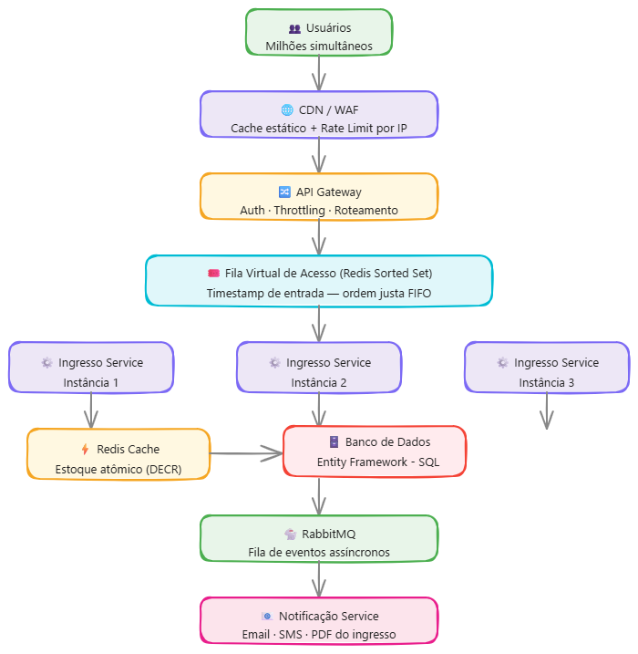

# rock-in-rio-arquitetura

Arquitetura para suportar venda de ingressos em alta demanda,
garantindo que nenhum ingresso seja vendido além do disponível
e que a compra seja justa para todos os usuários.

## Como funciona

**CDN / WAF** — Primeira barreira. Entrega o site rapidamente
e bloqueia acessos abusivos antes de chegar no servidor.

**API Gateway** — Portão de entrada. Verifica autenticação
e controla a quantidade de requisições por usuário.

**Fila Virtual (Redis Sorted Set)** — Ao entrar no site, o
usuário recebe um timestamp. A ordem de compra é definida
pela hora de chegada, independente da velocidade da internet.

**Ingresso Service** — Serviço principal em ASP.NET Core.
Processa a reserva e escala horizontalmente conforme demanda.

**Redis (Estoque)** — Controla o estoque com operação DECR
atomica, garantindo que dois usuários não comprem o mesmo
ingresso simultaneamente.

**Banco de Dados** — Persiste a compra de forma definitiva
via Entity Framework Core.

**RabbitMQ** — Após confirmação da compra, publica um evento
para o serviço de notificação de forma assíncrona.

**Notification Service** — Consome o evento do RabbitMQ
e envia o ingresso por email ou SMS ao usuário.

## Tecnologias
- **ASP.NET Core** · **Entity Framework Core** · **Redis** · **RabbitMQ**

